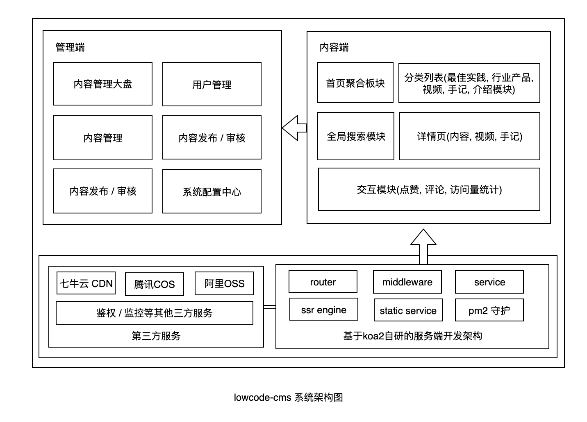

# lowcode-cms
基于dooring低代码社区的开源cms系统


线上体验地址: http://www.lowcoder.cn/

## 系统架构



### 目录介绍

- server 基于nodejs的服务端, 启动后可直接访问`3000` 端口, 也就是内容SSR端
- admin CMS的管理后台, 集成了用户管理, 内容审核, 内容发布, 数据统计等模块

开箱即用~~

### 本地启动

1. server端

```
# 进入server目录
cd server
# 安装依赖
yarn
# 服务端启动
yarn start
```

注: 如果是window系统, 可以执行 `yarn start:win`

2. 管理端

```
# 进入admin目录
cd admin
# 安装依赖
yarn
# 启动
yarn start
```

初始化账号: `super_123`, 密码: `zxzk_123`

3. 内容端

访问`3000`端口即可.


### 更多产品推荐 | More Production

| name                                                                              | Description                                                                             |
| --------------------------------------------------------------------------------- | --------------------------------------------------------------------------------------- |
| [H5-Dooring](https://github.com/MrXujiang/h5-Dooring)                             | 让 H5 制作像搭积木一样简单, 轻松搭建 H5 页面, H5 网站, PC 端网站, LowCode 平台.         |
| [V6.Dooring](https://github.com/MrXujiang/v6.dooring.public)                      | 可视化大屏解决方案, 提供一套可视化编辑引擎, 助力个人或企业轻松定制自己的可视化大屏应用. |
| [dooring-electron-lowcode](https://github.com/MrXujiang/dooring-electron-lowcode) | 基于 electron 的 H5-Dooring 编辑器桌面端.                                               |
| [xijs](https://github.com/MrXujiang/xijs)                             | 开箱即用的js业务工具库                                                            |
| [DooringX](https://github.com/H5-Dooring/dooringx)                                | 快速高效搭建可视化拖拽平台.                                                             |

## 赞助 | Sponsored

开源不易, 有了您的赞助, 我们会做的更好~


## 技术反馈和交流群 | Technical feedback and communication

微信：beautifulFront

